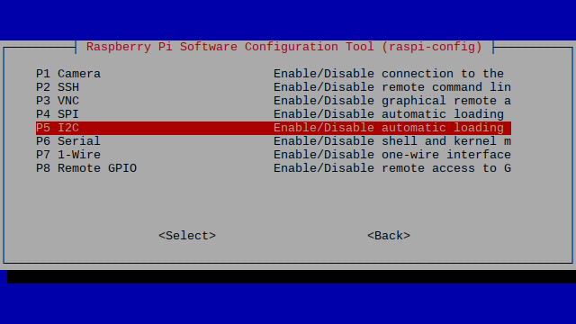

<p align="center">
  <a href="" rel="noopener">
 </a>
</p>

<h3 align="center">Sensors Node Project</h3>

<div align="center">

[]()


</div>

---


<p align="center"> Sensors Node Project
    <br> 
</p>

## 📝 Table of Contents

- [About](#about)
- [Getting Started](#getting_started)
- [Prerequisites](#deployment)
- [Installation and Config](#Installation_and_Config)
- [Test](#test)
- [Circuit](#circuit)
- [Built Using](#built_using)
- [Authors](#authors)

## 🧐 About <a name = "about"></a>

This repo contains circuit, firmware and backend for Sensors Node Project with drivers for

- BMP388
- BME680
- BMX055
- BMX160
- NEO-6M

## 🏁 Getting Started <a name = "getting_started"></a>

These instructions will get you a copy of the project up and running on your Raspberry Pi and ESP32.

### Prerequisites <a name = "Prerequisites"></a>

What things you need to install the software and how to install them.

```
- Raspberry Pi Model 3B, 3B+, 4B or CM4
- ESP32
```

## Installation and Configuration <a name = "Installation_and_Config"></a>

A step by step series that covers how to get the Firmware running.

### Raspberry Pi Firmware Pre-Reqs

1.  Download and install the latest Raspberry Pi OS Desktop image to your SD card
2.  Open the terminal and execute the following command
    ```sudo raspi-config```
3. Then follow the following pictures to enable I2C bus on you raspberry pi

* 
* 
* 
* 
* 

* Then do the same for Serial(UART) and SPI

* 
* 


### Configuring Raspberry Pi
#### DS3231 Configurations
  1.  Copy Firmware folder to the desktop of your Raspberry Pi, open the terminal of your Raspberry Pi and execute the following commands

  - ```sudo apt-get update```
  - ```sudo apt-get upgrade```
  - ```cd ~/Desktop/Firmware/```
  - ```sudo chmod a+rx starter.sh```
  - ```sudo apt install python3-pip```
  - ```sudo pip3 install --upgrade setuptools```
  - ```pip3 install paho-mqtt```
  - ```pip3 install smbus-cffi==0.5.1```
  - ```cd ~```
  - ```sudo pip3 install --upgrade adafruit-python-shell```
  - ```wget https://raw.githubusercontent.com/adafruit/Raspberry-Pi-Installer-Scripts/master/raspi-blinka.py```
  - ```sudo python3 raspi-blinka.py```
  - ```sudo pip3 install adafruit-circuitpython-bmp3xx```
  - ```sudo pip3 install adafruit-circuitpython-bme680```
  - ```pip install pynmea2```
  - ```sudo cp /boot/cmdline.txt /boot/cmdline_backup.txt```
  - ```sudo nano /boot/cmdline.txt```
  - Delete the file content and put the below content in it:
  - ```dwc_otg.lpm_enable=0 console=tty1 root=/dev/mmcblk0p2 rootfstype=ext4 elevator=deadline fsck.repair=yes rootwait quiet splash plymouth.ignore-serial-consoles```
  - Press CTRL+O and then CTRL+X to save and exit.
  - Again on terminal execute the following commands
  - ```sudo reboot```
  - ```sudosystemctl stop serial-getty@ttyAMA0.service```
  - ```sudosystemctl disable serial-getty@ttyAMA0.service```
  - ```sudosystemctl stop serial-getty@ttyS0.service```
  - ```sudosystemctl disable serial-getty@ttyS0.service```


 


## ⛏️ Testing <a name = "test"></a>

1.  The Firmware can be tested on Raspberry Pi
1.  Connect the sensors as shown in the Schematics section below.
2.  In the terminal execute the following commands to run the code
    1.  ```cd ~/Desktop/Firmware/```
    2.  ```./starter.sh```

## 🔌 Circuit Diagram <a name = "circuit"></a>


### Raspberry Pi Schematics


### ESP32 Pi Schematics


## Components Used

1.  Raspberry Pi
2.  ESP32
3.  Sensors


## ⛏️ Built Using <a name = "built_using"></a>

- [Python3](https://www.python.org/) - Raspberry Pi FW

## ✍️ Authors <a name = "authors"></a>

- [@Nauman3S](https://github.com/Nauman3S) - Development and Deployment
